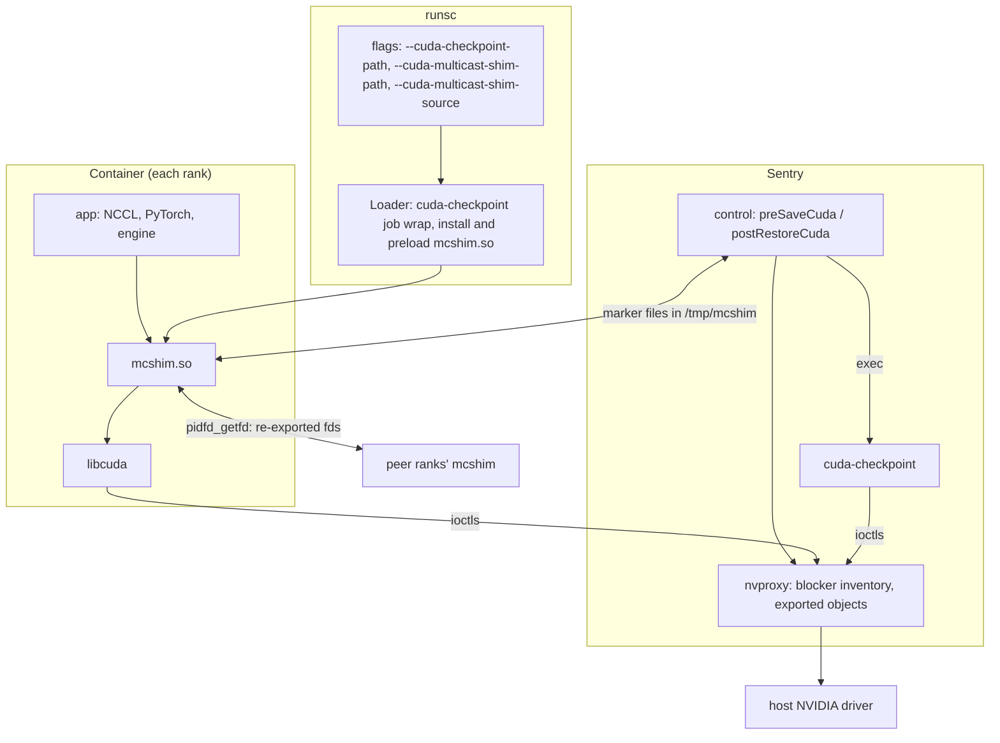
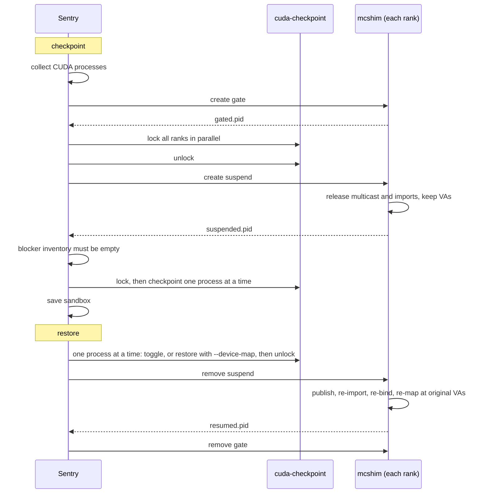

# Multi-GPU CUDA Checkpoint/Restore

Status as of 2026-09-29: Draft, seeking feedback on the
[open questions](#open-questions).

## Synopsis

Make `runsc checkpoint` / `runsc restore` work for single-node, multi-process,
multi-GPU CUDA workloads, e.g. tensor-parallel (TP) inference engines like
vLLM and SGLang, including restore onto a different set of GPUs, without
modifying the application, its libraries (NCCL, PyTorch, FlashInfer), or the
NVIDIA driver.

gVisor already checkpoints CUDA processes by running NVIDIA's
`cuda-checkpoint` on each of them (`runsc checkpoint --cuda-checkpoint-path`).
That works for processes that share no GPU state. Multi-GPU workloads do share
it: ranks map each other's GPU memory and, on NVSwitch systems, create NVLink
multicast groups, and `cuda-checkpoint` can neither checkpoint nor restore
that state. This proposal adds an opt-in interposer, preloaded into the
container's CUDA processes, that releases this state through the CUDA driver
API before `cuda-checkpoint` runs and rebuilds it at identical virtual
addresses after restore, plus the sentry support to drive it. Legacy CUDA IPC
is left to `cuda-checkpoint` itself: R610 carries it for processes in the same
*job*, which runsc arranges with `--cuda-checkpoint-path` (#13987).

Non-goals:

-   Multi-node / MNNVL (IMEX, fabric-handle memory shared across hosts).
-   NVIDIA drivers older than R610.
-   Checkpointing device memory contents. That remains `cuda-checkpoint`'s job.
-   Isolation. The interposer runs in the container's trust domain and is not
    a security boundary.

## Background

### What `cuda-checkpoint` cannot do

Measured with a PyTorch/NCCL test program at TP=2 and TP=4 on 8x H100 with
NVSwitch, driver 610.57.04, without the interposer:

Cross-process GPU state                                    | Created by                                                         | Result
---------------------------------------------------------- | ------------------------------------------------------------------ | ------
NVLink multicast group (`NV_MEMORY_MULTICAST_FABRIC`)      | NCCL NVLS, PyTorch symmetric memory, FlashInfer all-reduce fusion  | `cuda-checkpoint` hangs (killed after 240 s)
VMM IPC import (`cuMemImportFromShareableHandle`)          | NCCL peer-to-peer with `NCCL_CUMEM_ENABLE=1`                       | checkpoint succeeds, restore fails (`invalid argument`)
Legacy CUDA IPC import (`cuIpcOpenMemHandle`)              | NCCL with cuMem disabled, the engines' custom all-reduce           | `cuda-checkpoint` hangs (killed after 300 s)

R610's job mode (`cuda-checkpoint --launch-job`) fixes the last row, and only
that one.

Both engines hit this in their default configurations. vLLM 0.29.0 at TP=2
dispatches all-reduce to FlashInfer, custom and symmetric-memory backends
ahead of NCCL, and one rank holds 4 multicast objects; SGLang 0.5.20 at TP=4
holds 2. Without the interposer, the blocker inventory refuses the checkpoint
in both cases. Avoiding all of this means disabling
NVLS, custom all-reduce and symmetric memory in the engine and forcing NCCL off
its IPC transports, which gives up the intra-node NVLink paths these engines
are built around.

### Why not in the sentry

nvproxy already keeps a live RM object graph and replays it on restore, so
replaying multicast groups and imports from below was the first approach we
tried. It does not work:

1.  `cuda-checkpoint`'s restore rebuilds a process's RM client through paths
    nvproxy never sees, and RM rejects sentry-issued allocations into the
    restored client with `NV_ERR_INSUFFICIENT_PERMISSIONS` (measured on R580).
2.  libcuda keeps its own bookkeeping for this state, which goes stale if the
    objects change underneath it. For example, an allocation bound into a
    multicast group and left resident across the checkpoint restores fine,
    but its next export fails with `NV_ERR_OBJECT_NOT_FOUND` (measured on
    R610).

The CUDA driver API is the lowest layer at which this state can be torn down
and rebuilt consistently. An interposer there covers NCCL, PyTorch, FlashInfer
and the engines without patching any of them. Nothing in this proposal has the
sentry free or recreate RM objects on the application's behalf.

## Design



### The interposer (`tools/mcshim`)

A single C file (~2,400 lines, no CUDA toolkit dependency) that interposes 146
exported CUDA driver symbols: 118 that submit GPU work or wait on it
(launches, copies, memsets, stream memory operations and batches, with their
per-thread-stream variants), which the gate blocks, and 28 that track state,
refuse checkpoints, initialize, or resolve entry points. It is inert until a
process calls `cuInit`.

-   **Lookups.** torch, NCCL and ctypes resolve entry points with `dlsym`,
    `cuGetProcAddress` or cudart's `cudaGetDriverEntryPoint*`. The
    interposer redirects by the address a lookup returns, which identifies
    the exact exported symbol and so its ABI: `cuMulticastBindMem` resolves
    to the 7-argument `cuMulticastBindMem_v2` from CUDA 13.1, for example.
    A lookup of a tracked entry point that returns a symbol without a
    wrapper refuses checkpoints.
-   **Tracking.** VMM allocations, mappings and access (`cuMemCreate`,
    `cuMemMap`, `cuMemSetAccess`, `cuMemUnmap`, `cuMemRetainAllocationHandle`,
    `cuMemRelease`), multicast groups (`cuMulticastCreate`, `AddDevice`,
    `BindMem`, `BindAddr` and their `_v2` forms, `Unbind`), and VMM
    export/import. Legacy IPC is not interposed. Tracking is live state: an
    object is forgotten once it has no application reference, mapping or
    bind. Tables are fixed-size (4096 entries); overflow makes every later
    checkpoint fail up front.
-   **Suspend.** Unbind and release multicast groups, unmap (keeping the VA
    reservations), and release imports.
    Multicast-bound exporter allocations are copied to host memory (which the
    checkpoint carries) and released, because a resident one fails its next
    export after restore.
-   **Resume**, in phases across ranks: every exporter recreates its object,
    re-exports it, and publishes the new fd number under the original
    export's identity; importers copy the fd with `pidfd_getfd` and re-import;
    every group gets its devices back, then every bind, then every mapping at
    its original VA; finally the reference counts are restored.
    `cuMulticastBindMem` blocks until every device has joined, so adding all
    devices before any bind keeps ranks that hold groups in different orders
    from deadlocking, and publishing before fetching does the same for
    exports. `pidfd_getfd` needs ptrace access, which YAMA denies between
    sibling processes, so exporters set `PR_SET_PTRACER_ANY` until the sentry
    removes the gate after every process has resumed.
-   **Handles and references.** The application only sees the handle values
    it was given: rebuilt objects get new driver handles, and every
    handle-taking entry point translates. A new object whose driver handle
    equals a live object's application value gets a synthetic value. The
    interposer counts the application's references (create, import, retain,
    release) and restores that count after a rebuild. Calls are issued from
    each recorded device's primary context.
-   **Gate.** While armed, submission entry points and tracked mutators
    block. Calls are counted from entry to return and arming waits for them
    to drain, so no application thread can finish a call over the teardown
    or create shared state after the sentry verified there is none. A
    teardown or rebuild that fails partway leaves the application gated
    rather than running on inconsistent state.

Settings: `MCSHIM_LOG`, `MCSHIM_DISABLE`, `MCSHIM_ALLOW_FABRIC`
(fabric-handle support is reported as absent by default, so frameworks choose
POSIX fds).

### Delivery and injection (runsc)

-   `--cuda-checkpoint-path` (#13987) names `cuda-checkpoint` inside the
    container. On R610+ the loader wraps each GPU container's command in
    `cuda-checkpoint --launch-job`, so that its CUDA processes share a job,
    and checkpoints default to that binary and run it one process at a time,
    as jobs require (in parallel, SGLang's restore fails).
-   `--cuda-multicast-shim-path` names the interposer inside the container.
    `--cuda-multicast-shim-source=EMBEDDED` writes runsc's embedded copy there
    at container creation, through the container's VFS, so it lands in the
    rootfs overlay and is part of the checkpoint. `IMAGE` (the default) expects
    the image to carry it.
-   It requires `--cuda-checkpoint-path`: the interposer leaves legacy CUDA
    IPC to `cuda-checkpoint`, which carries it only for processes in a job.
-   It does nothing without nvproxy, and logs a warning and does nothing on
    drivers older than R610.
-   The loader prepends the interposer to `LD_PRELOAD` and appends it to
    `/etc/ld.so.preload`. The second is needed because launchers rewrite
    `LD_PRELOAD` for exactly the worker processes that hold GPU state (SGLang's
    `torch_memory_saver`), and the failure is silent: the checkpoint succeeds
    and the restore fails.
-   It sets `NCCL_CUMEM_ENABLE=1` unless the container sets it.

### Control protocol

The sentry and the interposer communicate through files in `/tmp/mcshim`,
which must be part of the checkpoint image (not a host mount). Markers are
existence-based and edge-triggered; content is never parsed. The sentry drives
the interposer in the processes that announced themselves (`present.<pid>`).

File                                | Writer      | Meaning
----------------------------------- | ----------- | -------
`gate`                              | sentry      | created: block GPU submission, drain calls in flight, check the state can be carried; removed: unblock
`suspend`                           | sentry      | created: tear down; removed: rebuild
`present.<pid>`                     | interposer  | this process participates
`gated.<pid>`                       | interposer  | gate armed and drained
`suspended.<pid>`, `resumed.<pid>`  | interposer  | teardown / rebuild finished
`error.<pid>`                       | interposer  | the transition failed; the sentry fails fast

`suspend` lives in the container filesystem, so it is part of the checkpoint:
after restore the interposer stays suspended until the sentry removes it.

### Checkpoint and restore sequence



The gate and the lock handle different halves of quiescing: the gate stops
new submissions, and `cuda-checkpoint --action lock` drains work in flight. A
rank gated just before a collective can starve peers already inside it; the
lock then times out and the checkpoint fails. Checkpoints are therefore taken
of a quiesced (asleep or idle) engine. The teardown runs between an unlock and
a re-lock because it has to call libcuda, which a locked process cannot do.

A failure before the teardown, or after it completed on every process,
unwinds: unlock, rebuild, release the gate, and the application keeps running.
A process whose state cannot be carried refuses the gate, before anything is
torn down: a table overflow, an unknown entry-point ABI, memory-pool IPC,
logical endpoints, non-POSIX-fd handles, sparse array mappings, or references
it could not restore (see `tools/mcshim/README.md`). If the teardown itself fails partway, peers may already
have released state the failed process needs, so nothing is rolled back: the
application stays blocked, the checkpoint fails, and the workload must be
restarted.

Without an interposer there is no gate or teardown, and two things still
differ from today: the checkpoint uses `cuda-checkpoint`'s two-phase
lock/checkpoint instead of a per-process `--toggle`, because a rank spinning
in a collective can only be quiesced while its peers are locking too; and the
blocker inventory refuses a checkpoint `cuda-checkpoint` would hang on.

### nvproxy additions

-   **Exported-object identity.** Every fd from `cuMemExportToShareableHandle`
    is an open of `/dev/nvidiactl`, so all of them share one inode, and a
    process that receives one over `SCM_RIGHTS` cannot tell which allocation
    it names. nvproxy already sees the `EXPORT_OBJECT(S)_TO_FD` controls; it
    records the exported `(client, object)` per fd and exposes it in
    `/proc/[pid]/fdinfo/[fd]`:

    ```
    nvproxy_exported_object:	client=0xc1d00922 object=0x5c000123 class=0x40
    ```

    This is the rendezvous key exporters and importers agree on after
    restore. Linux precedent: dmabuf and DRM `show_fdinfo`. Without it the
    interposer refuses the checkpoint.

This builds on #14525 (merged) and #14817 (approved) for restore onto other
GPUs, and #14850 (merged), a control libcuda issues on NVSwitch systems when
allocating and exporting VMM memory. It also uses a checkpoint blocker
inventory, to be proposed separately: nvproxy reports, per process, the live
multicast groups and fabric-memory imports that would make `cuda-checkpoint`
hang. Without the interposer the sentry refuses such a checkpoint up front;
with it, the inventory verifies the teardown.

## Validation

Two hosts, both with driver and fabric manager 610.57.04: 8x H100 80GB with
NVSwitch, and 8x B300 (NVLink 5). vLLM 0.29.0 and SGLang 0.5.20 serve
Qwen2.5-1.5B-Instruct in their default configurations plus the listed flags.
Each run boots the engine, records a completion at temperature 0, puts the
engine to sleep, checkpoints, restores (onto other GPUs where listed), wakes
it, and repeats the completion. A run passes if the output is identical and
the sandbox is on the requested GPUs.

All runs use `--cuda-checkpoint-path` (job mode) and the engines' custom
all-reduce. TP=8 serves Qwen2.5-3B-Instruct, since the 1.5B model's 12
attention heads do not split 8 ways.

H100:

Workload                                  | GPUs       | Checkpoint (image) | Restore | First inference after restore | vs. cold boot
----------------------------------------- | ---------- | ------------------ | ------- | ----------------------------- | -------------
vLLM TP=2                                 | 0,1        | 8.6 s (12G)        | 2.0 s   | 6.2 s                         | 36x
vLLM TP=4                                 | 0-3        | 14.2 s (18G)       | 2.8 s   | 11.0 s                        | 23x
vLLM TP=8                                 | 0-7        | 36.2 s (35G)       | 5.4 s   | 27.0 s                        | 12x
vLLM TP=2                                 | 0,1 -> 4,5 | 8.6 s (12G)        | 2.0 s   | 7.2 s                         | 31x
vLLM TP=4                                 | 0-3 -> 4-7 | 14.3 s (18G)       | 2.9 s   | 12.0 s                        | 21x
vLLM TP=2                                 | 0,1 -> 1,2 | 8.6 s (12G)        | 2.0 s   | 6.5 s                         | 35x
SGLang TP=4                               | 0-3        | 14.9 s (17G)       | 2.8 s   | 11.5 s                        | 16x
SGLang TP=4                               | 0-3 -> 4-7 | 15.0 s (17G)       | 2.8 s   | 12.4 s                        | 14x
SGLang TP=4 `--enable-nccl-nvls`          | 0-3        | 15.0 s (17G)       | 2.8 s   | 11.5 s                        | 16x
SGLang TP=4 `--enable-torch-symm-mem`     | 0-3        | 15.2 s (17G)       | 2.8 s   | 11.6 s                        | 16x
SGLang TP=4 FlashInfer all-reduce fusion  | 0-3        | 16.5 s (18G)       | 2.8 s   | 12.4 s                        | 14x
SGLang TP=4 FlashInfer all-reduce fusion  | 0-3 -> 4-7 | 16.6 s (18G)       | 2.9 s   | 13.6 s                        | 13x
SGLang TP=4 `--enable-nccl-nvls`          | 0-3 -> 4-7 | 15.1 s (17G)       | 3.0 s   | 12.8 s                        | 14x
SGLang TP=4 `--enable-torch-symm-mem`     | 0-3 -> 4-7 | 15.3 s (17G)       | 2.8 s   | 12.7 s                        | 14x
SGLang TP=8                               | 0-7        | 42.1 s (33G)       | 5.2 s   | 27.5 s                        | 8x

B300:

Workload                                  | GPUs       | Checkpoint (image) | Restore | First inference after restore | vs. cold boot
----------------------------------------- | ---------- | ------------------ | ------- | ----------------------------- | -------------
vLLM TP=2                                 | 0,1        | 8.6 s (14G)        | 1.6 s   | 6.3 s                         | 26x
vLLM TP=4                                 | 0-3        | 15.2 s (21G)       | 2.1 s   | 12.0 s                        | 15x
vLLM TP=8                                 | 0-7        | 37.0 s (41G)       | 3.7 s   | 32.1 s                        | 8x
vLLM TP=2                                 | 0,1 -> 4,5 | 8.6 s (14G)        | 1.6 s   | 6.4 s                         | 25x
vLLM TP=4                                 | 0-3 -> 4-7 | 15.1 s (21G)       | 2.0 s   | 12.8 s                        | 14x
vLLM TP=2                                 | 0,1 -> 1,2 | 8.6 s (14G)        | 1.6 s   | 6.5 s                         | 25x
SGLang TP=4                               | 0-3        | 18.2 s (19G)       | 2.1 s   | 13.8 s                        | 13x
SGLang TP=4                               | 0-3 -> 4-7 | 18.0 s (19G)       | 2.1 s   | 14.5 s                        | 12x
SGLang TP=4 `--enable-nccl-nvls`          | 0-3        | 18.4 s (19G)       | 2.1 s   | 13.7 s                        | 13x
SGLang TP=4 `--enable-torch-symm-mem`     | 0-3        | 18.5 s (19G)       | 2.1 s   | 13.9 s                        | 13x
SGLang TP=4 FlashInfer all-reduce fusion  | 0-3        | 20.7 s (20G)       | 2.2 s   | 14.5 s                        | 12x
SGLang TP=4 FlashInfer all-reduce fusion  | 0-3 -> 4-7 | 20.6 s (20G)       | 2.1 s   | 15.1 s                        | 12x
SGLang TP=4 `--enable-nccl-nvls`          | 0-3 -> 4-7 | 18.5 s (19G)       | 2.0 s   | 14.5 s                        | 12x
SGLang TP=4 `--enable-torch-symm-mem`     | 0-3 -> 4-7 | 18.7 s (19G)       | 2.1 s   | 14.5 s                        | 12x
SGLang TP=8                               | 0-7        | 43.9 s (37G)       | 3.4 s   | 34.3 s                        | 6x

Timings are from a single run per host; repeat runs varied by up to about
30%. The interposer's share is small: on H100, arming the gate takes about
0.1 s, the teardown 0.1 to 0.7 s, and the rebuild 0.9 to 1.7 s at TP=2 and
TP=4 and about 4 s at TP=8. vLLM TP=4, SGLang TP=4 with symmetric memory, and
the vLLM TP=2 cross-GPU restore also pass on H100 in containers without
`CAP_SYS_PTRACE`, where `pidfd_getfd` relies on the exporters'
`PR_SET_PTRACER_ANY`.

Job mode requires running `cuda-checkpoint` one process at a time. Against
running it in parallel (which an earlier version allowed; see
[Alternatives](#alternatives-considered)), that costs 2 to 3 s at TP=4. In an
alternating comparison with the page cache dropped before each run (3 runs
each of vLLM TP=4 and SGLang TP=4 with and without fusion), checkpoints took
14.5 to 16.2 s instead of 12.1 to 13.2 s, and the first inference after
restore 10.9 to 12.0 s instead of 8.6 to 9.2 s.

The same engines without the interposer are refused at checkpoint (see
[Background](#what-cuda-checkpoint-cannot-do)). The new nvproxy code (the
blocker inventory and exported-object tracking) has unit tests, including one
that pins the fdinfo line format.

## Alternatives considered

-   **RM-layer replay in nvproxy.** Rejected: see
    [Why not in the sentry](#why-not-in-the-sentry).
-   **Patching the libraries.** A fork of NCCL with communicator
    suspend/resume, driven by the engines' sleep endpoints, handles NCCL's own
    state but not PyTorch symmetric memory, the engines' custom all-reduce, or
    FlashInfer. Each would need its own patch, maintained against upstream.
-   **`cuda-checkpoint` job mode alone** (`--launch-job`, R610). It carries
    legacy IPC, but still hangs on multicast and fails to restore VMM
    imports: with the interposer handling only multicast, vLLM TP=4's restore
    fails with `invalid argument` on every rank holding VMM imports.
-   **Legacy IPC in the interposer.** An earlier version replaced each
    `cudaMalloc`'d range the application exported, at its original address,
    by an exported VMM allocation, making legacy IPC ordinary VMM IPC. It
    worked in every configuration tested and allowed parallel
    `cuda-checkpoint` (2 to 3 s faster at TP=4, see [Validation](#validation)),
    but cost ~400 lines of interposer code that job mode makes unnecessary.
-   **Disabling the features.** Works today, at the performance cost described
    above.
-   **Waiting for NVIDIA.** Preferred long term. The interposer is opt-in,
    stores no persistent state format, and can be deleted once
    `cuda-checkpoint` handles this state itself.

## Open questions

1.  **Where the interposer lives.** In-tree (`tools/mcshim`, embedded in runsc
    via `--cuda-multicast-shim-source=EMBEDDED`), or out of tree with runsc
    only injecting an image-supplied path (`IMAGE`)?
2.  **Writing `/etc/ld.so.preload`** into the container rootfs (through the
    overlay, never the host rootfs). `LD_PRELOAD` alone fails silently for
    SGLang. Acceptable, or behind its own flag?
3.  **Marker files as the control channel.** Chosen because the `suspend`
    marker is naturally part of the checkpoint, it needs no new sentry ABI,
    and forged markers only affect the container's own checkpoint. Would a
    sentry-provided device or socket be preferred?
4.  **The fdinfo line as a `/proc` contract.** Acceptable as is, or behind a
    flag?
5.  **Testing.** `tools/mcshim/test` drives the interposer through the marker
    protocol on two NVLS GPUs (lookup ABIs, gate draining, multicast rebuild,
    references, refusals, two-process imports). End-to-end coverage needs
    multiple GPUs on an NVSwitch host. Is a hardware-gated `test/gpu` target
    acceptable, with unit tests for the rest?

## Rollout

Once the open questions are settled, as independent PRs, each inert unless
the interposer flag is set:

1.  Exported-object tracking and the fdinfo line (nvproxy, `fsimpl/proc`).
2.  Two-phase lock/checkpoint (useful without the interposer), then the
    sentry control protocol and interposer sequencing (`pkg/sentry/control`).
3.  The `cuda-checkpoint` job wrap (#13987), then delivery and injection
    flags with `IMAGE` mode (`runsc/boot`, `runsc/config`).
4.  The interposer sources and `EMBEDDED` mode, if it lives in-tree.

## Appendix: operational notes

-   vLLM and SGLang are checkpointed after putting the engine to sleep (vLLM
    `/sleep?level=1`; SGLang `release_memory_occupation` with
    `--enable-memory-saver --enable-weights-cpu-backup`; without the backup
    flag the restored engine produced garbage output). A checkpoint under
    load may fail the lock phase; the application keeps running.
-   Only a single checkpoint then restore is validated. Chained restores,
    resuming after a successful save, and the failure unwinds have not been
    re-validated on R610.
-   Restore performance depends on host settings:
    `transparent_hugepage/shmem_enabled=always` and pinning the sandbox to the
    GPUs' NUMA node.
